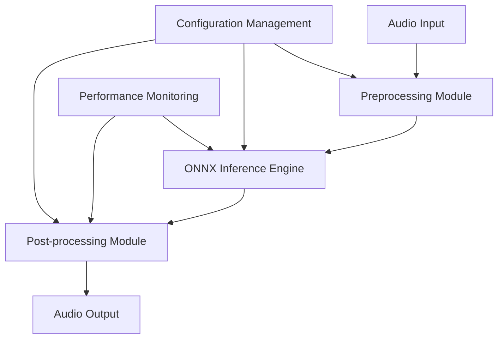

# 🎵 ZipEnhancer Rust

[](https://crates.io/crates/zipenhancer-rust)
[](https://docs.rs/zipenhancer-rust)
[](https://opensource.org/licenses/MIT)
[](https://www.rust-lang.org)
[]()

> 🚀 **High-Performance Real-Time Audio Noise Reduction Library** - Rust implementation based on ONNX Runtime, bringing pure and clear audio experience


**Language:** [English](README.md) | [中文](README_ZH.md)

## ✨ Feature Highlights

- 🎯 **Smart Noise Reduction**: ONNX model-based deep learning, precisely eliminates background noise
- ⚡ **Ultra-Fast Processing**: RTF 0.52, processes 2x faster than real-time
- 🔧 **Friendly Library Loading**: Smart detection of ONNX Runtime libraries with detailed error messages and solutions
- 💾 **Memory Safe**: Native Rust implementation, eliminates memory leaks
- 🌊 **Streaming Processing**: Supports audio files of any length without memory limitations
- 📊 **Real-time Monitoring**: Built-in performance monitoring, clear processing status at a glance
- 🛡️ **Smart Error Handling**: Clear error messages with solution suggestions, no need to guess configuration issues

## 🚀 Quick Start

### 🎬 5-Minute Quick Experience

```bash
# 1. Clone the project
git clone https://github.com/go-restream/zipenhancer-rs.git
cd zipenhancer-rs

# 2. Build the project
cargo build --release

# 3. Test run (no additional configuration required)
./zipenhancer.sh --test-only --input dummy.wav --verbose

# 4. Process audio file
./zipenhancer.sh \
  --input ./audio_examples/noise1.wav \
  --output enhanced.wav \
  --verbose
```

That's it! The program automatically finds ONNX Runtime libraries, and if not found, displays detailed installation guides.

### Basic Usage

```rust
use zipenhancer_rs::{AudioProcessor, Config};

#[tokio::main]
async fn main() -> Result<(), Box<dyn std::error::Error>> {
    // Create processor configuration
    let config = Config::builder()
        .model_path("path/to/your/model.onnx")
        .sample_rate(16000)
        .overlap_ratio(0.1)
        .build()?;

    // Create audio processor
    let processor = AudioProcessor::new(config).await?;

    // Process audio file
    processor.process_file(
        "input/noisy_audio.wav",
        "output/clean_audio.wav"
    ).await?;

    println!("Audio noise reduction completed!");
    Ok(())
}
```

### Command Line Tool

```bash
# Build the project
cargo build --release

# Use wrapper script (recommended, automatically handles ONNX Runtime library)
./zipenhancer.sh --help
./zipenhancer.sh --test-only --input dummy.wav

# Basic noise reduction
./zipenhancer.sh -i noisy.wav -o clean.wav

# Advanced options
./zipenhancer.sh \
  --input noisy.wav \
  --output clean.wav \
  --model model.onnx \
  --sample-rate 16000 \
  --overlap 0.1 \
  --verbose

# Specify ONNX Runtime library path
./zipenhancer.sh \
  --input noisy.wav \
  --output clean.wav \
  --onnx-lib /path/to/libonnxruntime.dylib
```

#### ONNX Runtime Setup

**Important**: ZipEnhancer requires ONNX Runtime library for model inference. We provide friendly library loading solutions:

```bash
# Method 1: Use wrapper script (recommended)
./zipenhancer.sh --test-only --input dummy.wav

# Method 2: Manual ONNX Runtime installation
brew install onnxruntime  # macOS
# Or download: https://github.com/microsoft/onnxruntime/releases

# Method 3: Specify library path
./zipenhancer.sh --onnx-lib /path/to/libonnxruntime.dylib --test-only --input dummy.wav
```

For detailed setup guide, please refer to: [README_ONNX_SETUP.md](docs/README_ONNX_SETUP.md)

#### Command Line Arguments

| Parameter | Short | Description | Default |
|-----------|-------|-------------|---------|
| `--input` | `-i` | Input audio file path (required) | - |
| `--output` | `-o` | Output audio file path | `output.wav` |
| `--model` | `-m` | ONNX model file path | `./model/ZipEnhancer_ONNX/ZipEnhancer.onnx` |
| `--sample-rate` | `-r` | Audio sample rate (Hz) | `16000` |
| `--overlap` | `-l` | Segment overlap ratio (0.0 - 1.0) | `0.1` |
| `--segment-size` | `-s` | Audio segment size (samples) | `16000` |
| `--onnx-lib` | - | ONNX Runtime library file path | Auto-detect |
| `--verbose` | `-v` | Enable verbose output mode | `false` |
| `--test-only` | - | Test mode only | `false` |
| `--inference-threads` | - | ONNX inference thread count | `4` |
| `--max-retries` | - | Maximum retry attempts | `3` |
| `--config` | `-c` | Configuration file path (TOML) | - |

### Layered Architecture Design
```txt
┌─────────────────────────────────────┐
│         Application Layer           │  main.rs, simple_processor.rs
├─────────────────────────────────────┤
│         Processing Coordination     │  processing/processor.rs
├─────────────────────────────────────┤
│         Inference Execution         │  onnx/inference.rs, onnx/session.rs
├─────────────────────────────────────┤
│         Preprocessing Layer         │  processing/preprocessor.rs
├─────────────────────────────────────┤
│         Data Transform Layer        │  audio/converter.rs
├─────────────────────────────────────┤
│         Core Audio Layer            │  audio/wav.rs
├─────────────────────────────────────┤
│         Utilities Layer             │  config.rs, error.rs
└─────────────────────────────────────┘
```

## 📊 Performance

### 🏆 Benchmark Results

| Metric | Value | Description |
|--------|-------|-------------|
| **RTF (Real-Time Factor)** | **0.52** | 1 second of audio requires only 393.50ms processing |
| **Average Inference Time** | **409.67ms** | Average processing time per audio segment |
| **Processing Success Rate** | **100%** | Reliable processing stability |
| **Memory Usage** | **< 50MB** | Low memory footprint design |
| **Inference Threads** | **4** | Multi-threaded parallel processing |

### 🎵 Supported Audio Formats

- **Input Formats**: WAV (16-bit PCM, 32-bit Float)
- **Output Formats**: WAV (16-bit PCM)
- **Sample Rates**: 8kHz - 48kHz (16kHz recommended)
- **Channels**: Mono/Stereo

## 🛠️ Advanced Configuration

### Configuration File Example

Create `config.toml`:

```toml
[model]
path = "model/ZipEnhancer.onnx"
max_retries = 3
inference_threads = 4

[audio]
sample_rate = 16000
overlap_ratio = 0.1
segment_size = 16000

[processing]
enable_agc = true
enable_performance_monitoring = true
verbose = true
```

### Environment Variables Configuration

```bash
export ZIPENHANCER_MODEL_PATH="./model.onnx"
export ZIPENHANCER_SAMPLE_RATE="16000"
export ZIPENHANCER_VERBOSE="true"
```

## 🎯 Use Cases

### 🎙️ Voice Call Optimization
```rust
// Real-time voice noise reduction
let processor = AudioProcessor::new(config).await?;
let clean_audio = processor.process_stream(&noisy_stream).await?;
```

### 🎧 Audio Post-Production
```bash
# Batch process audio files
for file in *.wav; do
    zipenhancer -i "$file" -o "clean_$file"
done
```

## 🏗️ Architecture Design



### Core Components

- **🎵 Audio I/O**: Efficient WAV file reading/writing and format conversion
- **🧠 ONNX Engine**: Deep learning inference based on ONNX Runtime
- **⚙️ Preprocessing**: Audio segmentation, overlap processing, format standardization
- **🔧 Post-processing**: Overlap-add, automatic gain control, audio reconstruction
- **📊 Monitoring System**: Real-time performance statistics and error tracking

## 🧪 Testing and Validation

### Run Test Suite

```bash
# Unit tests
cargo test

# Integration tests
cargo test --test integration

# Performance benchmarks
cargo bench
```

### Verify Audio Quality

```bash
# Generate test audio and verify processing effects
zipenhancer --test-only --verbose
```

## 📈 Performance Optimization

### 🚀 Improve Processing Speed

1. **Model Optimization**: Use quantized models to reduce inference time
2. **Parallel Processing**: Adjust `inference_threads` parameter
3. **Memory Pre-allocation**: Enable memory pools to reduce allocation overhead

### 💾 Reduce Memory Usage

```rust
let config = Config::builder()
    .segment_size(8000)  // Reduce segment size
    .overlap_ratio(0.05) // Reduce overlap ratio
    .build()?;
```

## 🤝 Contributing

We welcome all forms of contributions! Please check [CONTRIBUTING.md](CONTRIBUTING.md) for details.

### Development Environment Setup

```bash
# Clone repository
git clone https://github.com/go-restream/zipenhancer-rs.git
cd zipenhancer-rs

# Install dependencies (requires ONNX Runtime)
export ORT_STRATEGY=system
export ORT_LIB_LOCATION=/path/to/onnxruntime_sdk
export DYLD_LIBRARY_PATH=/path/to/lib:$DYLD_LIBRARY_PATH

# Build
cargo build --release
# or use make
make build

# Run tests
cargo test
# or use wrapper script
./zipenhancer.sh --test-only --input dummy.wav

# Check code formatting
cargo fmt --check
cargo clippy
```

## 📚 Documentation and Examples

- [📖 Full Documentation](https://docs.rs/zipenhancer-rust)
- [💡 Usage Examples](examples/)
- [🔧 API Reference](https://docs.rs/zipenhancer-rust/latest/zipenhancer_rust/)
- [⚙️ ONNX Runtime Setup Guide](docs/README_ONNX_SETUP.md) - Detailed library installation and configuration

## 🆘 Troubleshooting

### Common Issues

<details>
<summary>❌ ONNX Runtime Library Not Found</summary>

The program displays friendly error messages and solutions:
```bash
=== ONNX Runtime Library Not Found ===
Unable to find ONNX Runtime library file. Please ensure ONNX Runtime is installed or use the --onnx-lib parameter to specify the library file path.

Solutions:
1. Install using Homebrew: brew install onnxruntime
2. Download from official website: https://github.com/microsoft/onnxruntime/releases
3. Use --onnx-lib parameter to specify library path:
   ./zipenhancer.sh --onnx-lib /path/to/libonnxruntime.dylib [other parameters...]
```

For detailed solutions, please refer to: [docs/README_ONNX_SETUP.md](README_ONNX_SETUP.md)
</details>

<details>
<summary>❌ ONNX Model Loading Failed</summary>

Ensure model file path is correct and file exists:
```bash
# Check model file
ls -la model/ZipEnhancer.onnx

# Verify model format
python -c "import onnx; onnx.load('model/ZipEnhancer.onnx')"
```
</details>

<details>
<summary>⚡ Slow Processing Speed</summary>

Try the following optimization solutions:
```toml
config.toml:
[model]
inference_threads = 8  # Increase thread count

[audio]
segment_size = 32000   # Increase segment size
```
</details>

<details>
<summary>🔊 Audio Quality Issues</summary>

Adjust post-processing parameters:
```rust
let config = Config::builder()
    .enable_agc(true)        // Enable automatic gain control
    .agc_target_level(0.8)   // Adjust target volume
    .build()?;
```
</details>

## 📄 License

This project is licensed under the [MIT License](LICENSE).

## 🙏 Acknowledgments

- [ZipEnhancer Onnx](https://www.modelscope.cn/models/manyeyes/ZipEnhancer-se-16k-base-onnx) - Open source speech noise reduction model from Alibaba Tongyi Laboratory
- [ONNX Runtime](https://onnxruntime.ai/) - High-performance inference engine
- [Audio-Denoiser-ONNX](https://github.com/DakeQQ/Audio-Denoiser-ONNX) - Noise reduction tool collection

## 🔗 Related Links

- [📦 Crates.io](https://crates.io/crates/zipenhancer-rs)
- [📚 Documentation Website](https://docs.rs/zipenhancer-rust)
- [🐛 Issue Tracker](https://github.com/go-restream/zipenhancer-rs/issues)
- [💬 Discussions](https://github.com/go-restream/zipenhancer-rs/discussions)

---

<div align="center">

**🌟 If this project helps you, please give us a Star!**

Made with ❤️ by XiaoYang

</div>