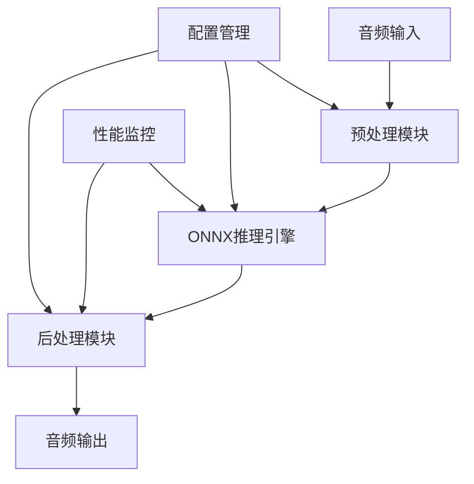

# 🎵 ZipEnhancer Rust

[](https://crates.io/crates/zipenhancer-rust)
[](https://docs.rs/zipenhancer-rust)
[](https://opensource.org/licenses/MIT)
[](https://www.rust-lang.org)
[]()

> 🚀 **高性能实时音频降噪库** - 基于 ONNX Runtime 的 Rust 实现，为您的音频带来纯净清晰的听觉体验


 [中文](README_ZH.md)  | [English](README.md)

## ✨ 特性亮点

- 🎯 **智能降噪**: 基于深度学习的 ONNX 模型，精准消除背景噪音
- ⚡ **极速处理**: RTF 0.52，处理速度比实时快 2 倍
- 🔧 **友好的库加载**: 智能检测 ONNX Runtime 库，提供详细的错误信息和解决方案
- 💾 **内存安全**: Rust 原生实现，杜绝内存泄漏问题
- 🌊 **流式处理**: 支持任意长度音频文件，无内存限制
- 📊 **实时监控**: 内置性能监控，实时处理状态一目了然
- 🛡️ **智能错误处理**: 清晰的错误信息和解决建议，无需猜测配置问题

## 🚀 快速开始

### 🎬 5分钟快速体验

```bash
# 1. 克隆项目
git clone https://github.com/go-restream/zipenhancer-rs.git
cd zipenhancer-rs

# 2. 构建项目
cargo build --release

# 3. 测试运行（无需额外配置）
./zipenhancer.sh --test-only --input dummy.wav --verbose

# 4. 处理音频文件
./zipenhancer.sh \
  --input ./audio_examples/noise1.wav \
  --output enhanced.wav \
  --verbose
```

就这么简单！程序会自动查找 ONNX Runtime 库，如果找不到会显示详细的安装指南。

### 基础使用

```rust
use zipenhancer_rs::{AudioProcessor, Config};

#[tokio::main]
async fn main() -> Result<(), Box<dyn std::error::Error>> {
    // 创建处理器配置
    let config = Config::builder()
        .model_path("path/to/your/model.onnx")
        .sample_rate(16000)
        .overlap_ratio(0.1)
        .build()?;

    // 创建音频处理器
    let processor = AudioProcessor::new(config).await?;

    // 处理音频文件
    processor.process_file(
        "input/noisy_audio.wav",
        "output/clean_audio.wav"
    ).await?;

    println!("音频降噪完成！");
    Ok(())
}
```

### 命令行工具

```bash
# 构建项目
cargo build --release

# 使用包装脚本（推荐，自动处理ONNX Runtime库）
./zipenhancer.sh --help
./zipenhancer.sh --test-only --input dummy.wav

# 基础降噪处理
./zipenhancer.sh -i noisy.wav -o clean.wav

# 高级选项
./zipenhancer.sh \
  --input noisy.wav \
  --output clean.wav \
  --model model.onnx \
  --sample-rate 16000 \
  --overlap 0.1 \
  --verbose

# 指定ONNX Runtime库路径
./zipenhancer.sh \
  --input noisy.wav \
  --output clean.wav \
  --onnx-lib /path/to/libonnxruntime.dylib
```

#### ONNX Runtime 设置

**重要**: ZipEnhancer 需要 ONNX Runtime 库来进行模型推理。我们提供了友好的库加载解决方案：

```bash
# 方法1: 使用包装脚本（推荐）
./zipenhancer.sh --test-only --input dummy.wav

# 方法2: 手动安装ONNX Runtime
brew install onnxruntime  # macOS
# 或下载: https://github.com/microsoft/onnxruntime/releases

# 方法3: 指定库路径
./zipenhancer.sh --onnx-lib /path/to/libonnxruntime.dylib --test-only --input dummy.wav
```

详细设置指南请参考: [README_ONNX_SETUP.md](docs/README_ONNX_SETUP.md)

#### 命令行参数

| 参数 | 简写 | 说明 | 默认值 |
|------|------|------|--------|
| `--input` | `-i` | 输入音频文件路径 (必需) | - |
| `--output` | `-o` | 输出音频文件路径 | `output.wav` |
| `--model` | `-m` | ONNX 模型文件路径 | `./model/ZipEnhancer_ONNX/ZipEnhancer.onnx` |
| `--sample-rate` | `-r` | 音频采样率 (Hz) | `16000` |
| `--overlap` | `-l` | 段间重叠比例 (0.0 - 1.0) | `0.1` |
| `--segment-size` | `-s` | 音频段大小（样本数） | `16000` |
| `--onnx-lib` | - | ONNX Runtime 库文件路径 | 自动查找 |
| `--verbose` | `-v` | 启用详细输出模式 | `false` |
| `--test-only` | - | 仅运行测试模式 | `false` |
| `--inference-threads` | - | ONNX 推理线程数 | `4` |
| `--max-retries` | - | 最大重试次数 | `3` |
| `--config` | `-c` | 配置文件路径 (TOML) | - |


### 分层架构设计
```txt
┌─────────────────────────────────────┐
│         应用层 (Application)         │  main.rs, simple_processor.rs
├─────────────────────────────────────┤
│         处理协调层 (Processing)       │  processing/processor.rs
├─────────────────────────────────────┤
│         推理执行层 (Inference)        │  onnx/inference.rs, onnx/session.rs
├─────────────────────────────────────┤
│         预处理层 (Preprocessing)     │  processing/preprocessor.rs
├─────────────────────────────────────┤
│         数据转换层 (Data Transform)  │  audio/converter.rs
├─────────────────────────────────────┤
│         基础音频层 (Audio Core)      │  audio/wav.rs
├─────────────────────────────────────┤
│         工具支持层 (Utilities)       │  config.rs, error.rs
└─────────────────────────────────────┘
```


## 📊 性能表现

### 🏆 基准测试结果

| 指标 | 数值 | 说明 |
|------|------|------|
| **RTF (实时因子)** | **0.52** | 1秒音频仅需393.50处理 |
| **平均推理时间** | **409.67ms** | 单段音频平均处理时间 |
| **处理成功率** | **100%** | 稳定的处理可靠性 |
| **内存占用** | **< 50MB** | 低内存使用设计 |
| **推理线程数** | **4** | 多线程并行处理 |

### 🎵 支持的音频格式

- **输入格式**: WAV (16-bit PCM, 32-bit Float)
- **输出格式**: WAV (16-bit PCM)
- **采样率**: 8kHz - 48kHz (推荐 16kHz)
- **声道**: 单声道/立体声

## 🛠️ 高级配置

### 配置文件示例

创建 `config.toml`:

```toml
[model]
path = "model/ZipEnhancer.onnx"
max_retries = 3
inference_threads = 4

[audio]
sample_rate = 16000
overlap_ratio = 0.1
segment_size = 16000

[processing]
enable_agc = true
enable_performance_monitoring = true
verbose = true
```

### 环境变量配置

```bash
export ZIPENHANCER_MODEL_PATH="./model.onnx"
export ZIPENHANCER_SAMPLE_RATE="16000"
export ZIPENHANCER_VERBOSE="true"
```

## 🎯 使用场景

### 🎙️ 语音通话优化
```rust
// 实时语音降噪
let processor = AudioProcessor::new(config).await?;
let clean_audio = processor.process_stream(&noisy_stream).await?;
```

### 🎧 音频后期制作
```bash
# 批量处理音频文件
for file in *.wav; do
    zipenhancer -i "$file" -o "clean_$file"
done
```


## 🏗️ 架构设计



### 核心组件

- **🎵 音频I/O**: 高效的WAV文件读写和格式转换
- **🧠 ONNX引擎**: 基于ONNX Runtime的深度学习推理
- **⚙️ 预处理**: 音频分段、重叠处理、格式标准化
- **🔧 后处理**: 重叠相加、自动增益控制、音频重建
- **📊 监控系统**: 实时性能统计和错误追踪

## 🧪 测试与验证

### 运行测试套件

```bash
# 单元测试
cargo test

# 集成测试
cargo test --test integration

# 性能基准测试
cargo bench
```

### 验证音频质量

```bash
# 生成测试音频并验证处理效果
zipenhancer --test-only --verbose
```

## 📈 性能优化

### 🚀 提升处理速度

1. **模型优化**: 使用量化模型减少推理时间
2. **并行处理**: 调整 `inference_threads` 参数
3. **内存预分配**: 启用内存池减少分配开销

### 💾 降低内存使用

```rust
let config = Config::builder()
    .segment_size(8000)  // 减小分段大小
    .overlap_ratio(0.05) // 减小重叠比例
    .build()?;
```

## 🤝 贡献指南

我们欢迎所有形式的贡献！请查看 [CONTRIBUTING.md](CONTRIBUTING.md) 了解详细信息。

### 开发环境设置

```bash
# 克隆仓库
git clone https://github.com/go-restream/zipenhancer-rs.git
cd zipenhancer-rs

# 安装依赖（需要ONNX Runtime）
export ORT_STRATEGY=system
export ORT_LIB_LOCATION=/path/to/onnxruntime_sdk
export DYLD_LIBRARY_PATH=/path/to/lib:$DYLD_LIBRARY_PATH

# 构建
cargo build --release
# or 使用make
make build

# 运行测试
cargo test
# or 使用包装脚本
./zipenhancer.sh --test-only --input dummy.wav

# 检查代码格式
cargo fmt --check
cargo clippy
```

## 📚 文档与示例

- [📖 完整文档](https://docs.rs/zipenhancer-rust)
- [💡 使用示例](examples/)
- [🔧 API 参考](https://docs.rs/zipenhancer-rust/latest/zipenhancer_rust/)
- [⚙️ ONNX Runtime 设置指南](docs/README_ONNX_SETUP.md) - 详细的库安装和配置说明

## 🆘 故障排除

### 常见问题

<details>
<summary>❌ ONNX Runtime 库未找到</summary>

程序显示友好的错误信息和解决方案：
```bash
=== ONNX Runtime 库未找到 ===
无法找到 ONNX Runtime 库文件。请确保已安装 ONNX Runtime 或使用 --onnx-lib 参数指定库文件路径。

解决方案:
1. 使用 Homebrew 安装: brew install onnxruntime
2. 从官网下载: https://github.com/microsoft/onnxruntime/releases
3. 使用 --onnx-lib 参数指定库文件路径:
   ./zipenhancer.sh --onnx-lib /path/to/libonnxruntime.dylib [其他参数...]
```

详细解决方法请参考: [docs/README_ONNX_SETUP.md](README_ONNX_SETUP.md)
</details>

<details>
<summary>❌ ONNX模型加载失败</summary>

确保模型文件路径正确且文件存在：
```bash
# 检查模型文件
ls -la model/ZipEnhancer.onnx

# 验证模型格式
python -c "import onnx; onnx.load('model/ZipEnhancer.onnx')"
```
</details>

<details>
<summary>⚡ 处理速度较慢</summary>

尝试以下优化方案：
```toml
config.toml:
[model]
inference_threads = 8  # 增加线程数

[audio]
segment_size = 32000   # 增大分段大小
```
</details>

<details>
<summary>🔊 音频质量问题</summary>

调整后处理参数：
```rust
let config = Config::builder()
    .enable_agc(true)        // 启用自动增益控制
    .agc_target_level(0.8)   // 调整目标音量
    .build()?;
```
</details>

## 📄 许可证

本项目采用 [MIT 许可证](LICENSE)。

## 🙏 致谢
- - [ZipEnhancer Onnx](https://www.modelscope.cn/models/manyeyes/ZipEnhancer-se-16k-base-onnx) 阿里通义实验室开源的语音降噪模型ZipEnhancer
- [ONNX Runtime](https://onnxruntime.ai/) - 高性能推理引擎
- [Audio-Denoiser-ONNX](https://github.com/DakeQQ/Audio-Denoiser-ONNX) -降噪工具集


## 🔗 相关链接

- [📦 Crates.io](https://crates.io/crates/zipenhancer-rs)
- [📚 文档网站](https://docs.rs/zipenhancer-rust)
- [🐛 问题反馈](https://github.com/go-restream/zipenhancer-rs/issues)
- [💬 讨论区](https://github.com/go-restream/zipenhancer-rs/discussions)

---

<div align="center">

**🌟 如果这个项目对您有帮助，请给我们一个 Star！**

Made with ❤️ by the XiaoYang 

</div>